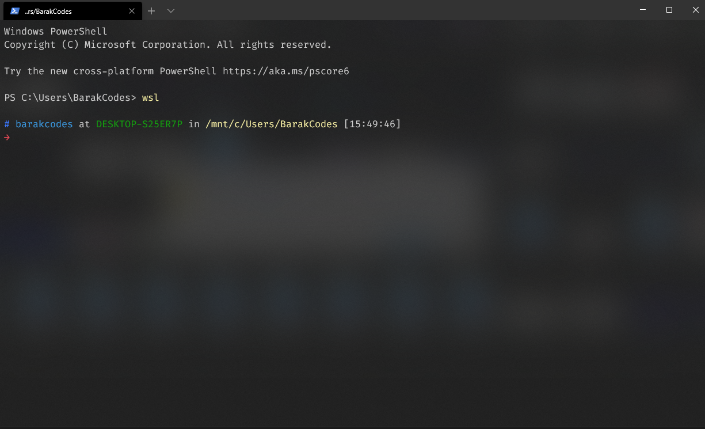
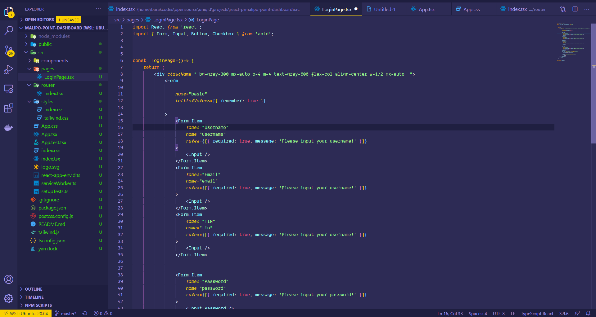

Windows has gotten better over the past year since the introduction of WSL(Window's Linux thingy) 2.  I have been using windows for almost all my life as a developer and outside of dev stuff as well. It offers a decent enough experience and I enjoy using it is mostly a decently enjoyable experience.

  So I just wanted to share how I like to set up my windows PC for work and sometimes play and all the stuff I like to use for different reasons.

So let's get started

 1. First and foremost we turn on the bad boy WSL 2 just to get the restart stuff out of the way., Microsoft has made this pretty easy using PowerShell and they have a simple guide right below here. 

[Install Windows Subsystem for Linux (WSL) on Windows 10](https://docs.microsoft.com/en-us/windows/wsl/install-win10#set-your-distribution-version-to-wsl-1-or-wsl-2)

 2.  After that's all done the next parts are just the norms for a typescript developer. I gotta have Node.js, chrome, postman, android studio, MongoDB and of course the new terminal and my ubuntu distro for WSL the current one right now being version 20.1

3. From here, I'll be setting up my WSL for development of applications. So first things first with this I gotta upgrade just to make sure everything is in check before proceeding.

```bash
sudo apt update
sudo apt upgrade
```

3. Then I get node.js installed, with this we probably want to get the latest LTS versions since I do use docker most of the time anyway so there won't be that much of switching context so I don't think I need nvm. Node has this up on their site.

[nodesource/distributions](https://github.com/nodesource/distributions/blob/master/README.md)

```bash
curl -sL https://deb.nodesource.com/setup_12.x | sudo -E bash -
sudo apt-get install -y nodejs
```

 Well after installing node I always install yarn since I prefer yarn over npm not that there's really any major differences but I'm just used to it at this point

 

```bash
curl -sL https://dl.yarnpkg.com/debian/pubkey.gpg | sudo apt-key add -
echo "deb https://dl.yarnpkg.com/debian/ stable main" | sudo tee /etc/apt/sources.list.d/yarn.list
sudo apt-get update && sudo apt-get install yarn
```

With yarn installed time to solve that pesky node modules  " use sudo while installing packages globally" thing. Npm has really good instructions on that.

I just looked at my terminal oh god we gotta make it a bit usable. I prefer using zsh it makes the shell a bit nicer in my opinion. Zsh is available here.

[ohmyzsh/ohmyzsh](https://github.com/ohmyzsh/ohmyzsh/wiki/Installing-ZSH)

Using zsh I default to ohmyzsh I have basically defaulted to this for all my linux life.

```bash
sudo apt install zsh

sh -c "$(curl -fsSL https://raw.githubusercontent.com/ohmyzsh/ohmyzsh/master/tools/install.sh)"
```

Now that we have this setup let's make use of this shell. First up let's add a theme to it to make it more personalized. I prefer, but you are free to choose whichever one you please there's a lot of them out there.

[oskarkrawczyk/honukai-iterm-zsh](https://github.com/oskarkrawczyk/honukai-iterm-zsh)

```bash
cd .oh-my-zsh/themes

nano honukai.zsh-theme

ZSH_THEME="honukai"
```

```bash
plugins=(
git
colorize
docker-compose
docker
gatsby
git-flow
golang
heroku
kubectl
microk8s
yarn
)

nano ~/.zshrc
source ~/.zshrc
```

After all that is done you probably have already set zsh as your default terminal but just if you haven't time to do it now

```bash
chsh -s $(which zsh)
```

  We're almost getting there well just install the "new" windows terminal it's been out for a while already. To get it just head over to the store and search  "terminal"  it should be the first result you get.

Note: Don't you dare forget to add auto suggestions they're killer and needed for a daily life of anyone.

[zsh-users/zsh-autosuggestions](https://github.com/zsh-users/zsh-autosuggestions/blob/master/INSTALL.md)

With that downloaded only one thing is missing now, custom fonts. Well I prefer Fira Code it's free and open-source and it supports ligatures so that makes it amazing at least for me.



You should see some changes here after refreshing the terminal. Well at least it looks something.  

Now that everything is setup let's get down to installing an all-time essential docker. They put it really well on the documentation but let me save you the trip, besides I know you just want to copy the commands over right.  Well, this 👇way.

```bash
# step 0
sudo apt-get update
# step 1
sudo apt-get install \
    apt-transport-https \
    ca-certificates \
    curl \
    gnupg-agent \
    software-properties-common

# step 2
curl -fsSL https://download.docker.com/linux/ubuntu/gpg | sudo apt-key add -

# step 3
sudo add-apt-repository \
   "deb [arch=amd64] https://download.docker.com/linux/ubuntu \
   $(lsb_release -cs) \
   stable"

# step 4
sudo apt-get update
sudo apt-get install docker-ce docker-ce-cli containerd.io

# step 5
sudo docker run hello-world

```

After all that  installing, you should see a proper response which is just a hello back from docker. Well everything runs but ideally you don't want this, by this I mean having to type in "sudo" every time you want to use docker.

     So to solve this we'll just create a user group and add docker to it so we can easily keep our freedom and use docker as is. And it's just so easy we don't have a reason not to.

```bash
# step 1
sudo groupadd docker

# step 2
sudo usermod -aG docker $USER

# step 3
newgrp docker
# step 4
docker run hello-world
```

Now that we got rid of sudo for docker let's make sure it's always running to avoid having to start the docker daemon every time we want to use docker.

```bash
sudo systemctl enable docker

sudo systemctl disable docker
```

Okay now we're almost done with our development environment we just need to install one more crucial component docker compose. For those that are not familiar with it I'v linked it here. Basically it allows us to run multiple container at the same time much like a server does. It makes for a crucial task as it allows me to test and develop in almost equal environment as how the server will operate. But also because you can easily setup local domains and custom ssl for the full experience but that's for another day. Today let's just install it.

```bash

sudo curl -L "https://github.com/docker/compose/releases/download/1.26.2/docker-compose-$(uname -s)-$(uname -m)" -o /usr/local/bin/docker-compose
sudo chmod +x /usr/local/bin/docker-compose
```

Well, there you have it this is just the minimum I need to get my development flow up and running. If you feel like you need more stuff definitely go on, don't let me stop you.  Oops, I forgot this one, I just finished learning golang and I'm going to start using it so I should probably install that too.

```bash
sudo apt install golang
```

 Wow, we've come a long way lets head. Most of this remaining part is just personal preference so if you only wanted to know about the setup this should be enough, but for the rest of us who love vscode let's go on.

 So here is my vscode set up together with all the plugins I use, For those of you who have no idea what vs code is, It's basically one of the greatest IDE's out there, it's free and it's backed by Microsoft.

First and foremost the plugins I use

- WSL- plugins: Super crucial for the best experience for well WSL
- Docker
- emojisense
- Bracket Pair Colorizer
- Debugger for Chrome
- Shades of purple: The theme I use.

You should get somewhere pretty close to this  


