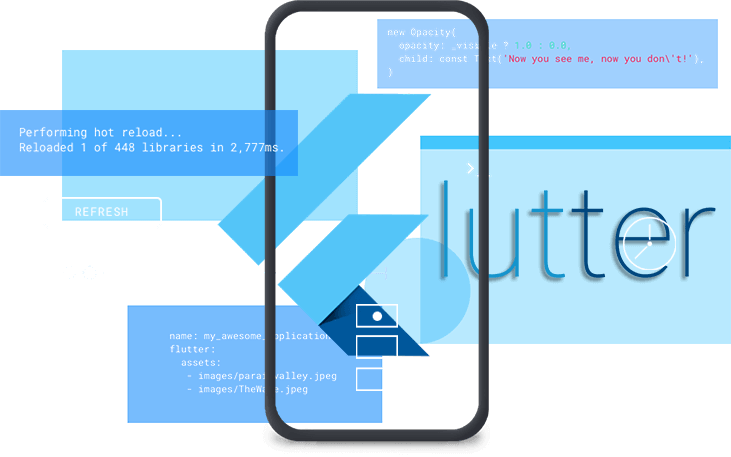
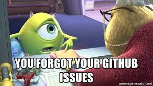
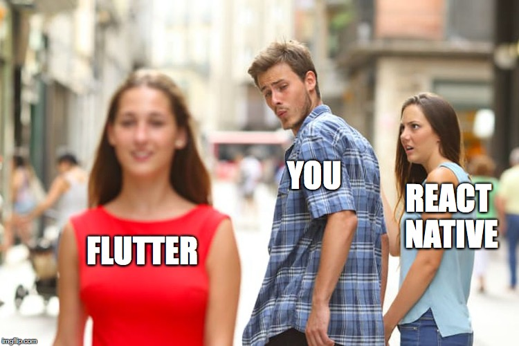

  [Flutter](https://flutter.dev) is UI framework for building native cross-platform applications for mobile,web and desktop. If you have been living under a rock, flutter has been a trend for a while thanks to Google's efforts.
  What makes flutter different from other frameworks is that it does not use any native bridge to the devices neither does it emulate but it natively complies to 
  native machine code this allows it to be more perfomant than other solutions. It uses the [dart](https://dart.dev) language which is   a mix of javascript with 
  the object-oriented style of java, so anyone from both worlds can easily pick it up. In this article, I will be using react-native as a reference point for flutter since  it's the only one with a big enough audience and
   I've worked with react-native in the past.Flutter has come a long way this year and I wanted to evaluate its current progress before starting the new year I  categorized my review into three parts:
  

  ### The Good
   The coming of flutter brought a lot of good new stuff that was not available in the cross-platform mobile development industry. This helped convince a lot of people to get on board and was just compelling to developers. 
   Some of the things that got me really excited about flutter and still make me love using flutter to date are:  
   
  **# It complies to fully native code 📱** and doesn't need any bridges or emulations. This allows flutter to be**more performant, have smoother animations and UI components in general.**
  It hasn't really been possible to completely out of the box to get the performance and a fully robust framework before, it includes all you can ever want in a single framework
  routing,state management (Although it's not the best), robust animation builder and more all of this without having to install a single dependency. I bet you can get away with 
  building a complete functional app without using any third part dependencies this on it's own is really amazing comparing to the react native world where react on it's own can
  not do much.  

  **# It gives you control over every pixel painted  on the screen, CustomerPainter🖌** widget(Side note:everything in flutter is a widget) this gives you **complete control on what to paint on
  the screen** it's like a pencil and paper and the only limit really is your imagination with a lot built-in drawing functions like quadratic curves and much more having this much 
  control is truly amazing pairing this with how easy it is to implement animations can give birth to spectacular design true pieces of art 👌, a good example of this how [gskinner](https://flutter.gskinner.com)
  showcased how really powerful this can be with a bunch of really cool animations and interactions. Flutter tried to show off by getting a digital artist who uses flutter to share
  sample "paintings" to illustrate how powerful flutter really. This is one my most favorite thing about flutter knowing that whenever I need something I could always do it no matter how
  complex it might seem.  

  **# It makes it so easy to create UI🎨** just at the very beginning no need to get any expertise on anything as there's basically a widget for anything that you actively use and some of them you 
  might only use once in your development process, that paired with the ease in theming, material theming is supported out of the box not forgetting the trendy dark mode support is available
  too this makes for easy theming beautiful applications and all of this in such a short time. The first time I used flutter and just saw how easy it is to build out UI I wanted to re-do everything
  in the past with flutter also every UI kit I saw the first thing was like how would I do this in flutter this was all because of how fun it is to build out UI in flutter.  
 Given its flexibility this means it can also be used for making 2D games many developers have tried this I'm not really into game development but just researching
 around it turns  out that people are really liking flutter for game development and it doesn't have any performance issues. One of the popular game development is [flame](https://flame-engine.org),many seem to be enjoying
 playing with it.  

**# Flutter has managed to gain a huge following from the community in  the short time** it's been around it has grown to be the most active topic on StackOverflow and the highest growing skill on linked in.
  So whatever Google is doing it sure is working. Part of why Flutter has grown so much in such little time includes the ease of learning flutter, the official youtube
  channel which explains concepts with short videos "The widget of the week", the long in-depth series "The Boring Show" which I have to say is by far my favorite show and 
  some of the newer series on different topic animations included, apart from this there's a lot of new channels on youtube with a lot of good content on flutter, this just 
  makes it super easy for anyone to learn. Another positive is the Flutter challenges that Google pushes,the conference talks without forgetting the twitter movement that is
  just immense right now. All this and some others I might have not mentioned is just how friendly the flutter community. All this has made flutter one of the most popular
  technologies currently, at some point it got more popular than say it's "rival" react-native. 

 
  ### The bad
   Up to this point flutter seems like a unicorn trend that we all should be on,but it's not all fluttery smooth out here in this land. Flutter has a few turn downs, some stuff that's about the language
   and other just about the framework and it's shorter time in the space. I've compiled my concerns into a few categories addressing my concerns on the current state of the framework:  
   
    **# The dart language syntax is just the insane amount of nesting** that goes around in making the widgets or "screens" so to say.It's okay
   for small to medium-sized components but anything past that gets a little fuzzy and confusing as to where your component starts or ends.For people coming from react native this will be the obvious negative.
   I found that separating out the component into smaller build function or widgets helps a lot especially when you have complex UI with a lot of changing states it makes it a little bearable but still this approach is not the best but this is a dart 
   specific thing so I highly dought that it's changing anytime soon, so we just have to find workarounds around this. 
     
    **# The promise of it being entirely cross plaform is still a work in progress🚧**,I know you're like "what are you trying to say here", I have to admit yes I am a fan of flutter but atleast for now 
  I would advise to use in mobile applications where it just slays with its possitives that I already talked about, but for the web and desktop implementations although making really promising changes
  it's nowhere near ready for production especially for large scale applications. Starting with the web that is currently in beta it still lacks support for some basic things that just don't make sense for
   like easy hover effects, selectable text, smooth scrolling and many other small quirks that don't make it a go to solution for anyone doing web right now to consider it,I guess that's what it means by
  being in beta I have no doughts that say a year from now I would have completely  different opinions and this is just by how much effort the flutter team is putting to push the framework forward but comparing
  it to  react-native and electron for desktop applications this is a much more complete solution,if you're trying to build out a fully cross-platform application. Though I have to hand it to them
  the idea of writing once in flutter is just more enticing because you literally just write once and you can build into different platforms unlike other solutions where it's not as clear as writting once 
  you still have to deal with a lot of tooling to achieve that although [expo](https://expo.io) is trying to make it easy for react native but it's not as seamless as Flutter promises and once 
  all of this is out of beta and alpha for the desktop implementation, I will save my arguments for later.But as for the current state I would only consider Flutter for mobile applications looking to expand to
  other platforms in the far future once everything is out of testing.  
   
  **# Flutter does not deal with any native  components it means that all the IOS and Android material design components have to be implemented by the Flutter team** and then packaged for use in the development
  process the downside here no offense to the flutter team is that one it's not always going to be up to date with the native library of components say Cupertino could introduce new action sheets, for all the 
  flutter apps this change would not be reflected until the next time the flutter team updates the component or widget so to say to match the current updates also the behaviour of flutter components might not always
  match the native components because again  all of this is a recreation of the native behaviour in Flutter, I have no doughts about android since Flutter is based on material design so it's not really
  a concern come cupertino though it's not quite the same and some developers are already complaining about this. In flutter's defence apps that stick to their custom design system this would be the best solution
  and the current implementation work well enough.  

  **# The insane amount of github issues it still has is concerning** this shows that the team is so focused on pushing new features, leaving the  the framework's maintenance. This is  a big  problem tha flutter faces.
  This situation  needs fixing and if this continues,it really gives off a weird vibe on the maintenance of the project.
  
    My final complain is not really something to complain about it's something I miss from react native, and that's the ability to push updates to your app without having to do a new build  and sending it over to the 
playstore I have to admit this is one of the features that I miss the most. I know because of flutter's architecure this is nearly impossible because the app is compiled to machine code and hence no VM's in the app
this means that it's not possible to push dart code to it and shipping an app with the dart VM means significantly bigger app sizes which well not a good tradeoff at any time.
 
 ### The Competition
  With flutter coming into play it has possitively impacted other frameworks react native being the main focus here to move forward and realy up their game to match up to Flutter.
  It is important to keep in mind that *these are just tools*. React native has made really big changes I mean they even introduced a CLI update that comes with doctor commmand.  
 
  from flutter ` flutter  doctor`  
 in react native 
     `react-native doctor`  

 One of the pain point of react-native was just that **hot reload🔥** wasn't as responsive and was sometimes really buggy and this was also a contributing factor to why I really loved flutter,
 out of the consisitency I got with it. But now react native just realesed  **fast refresh** which wors really well and I have to give it some credit here it's on pur with Flutter's hot reload.
  To improve the **perfomance ⚡️** , here they just went ahead and released a new javascript engine  named *Hermes* this significantly improved the perfomance on startup but still though
  not on pur with react native the gap has reduced.  
  Finally the thing that bugged me the most was dealing with native dependencies this was just such a pain that the community created starters to handle just that, It would take ages to
  fully configure and fight all the bugs that came with **adding third party native dependencies 🚧**(For those who never used react native, native dependencies are dependencies that were a bridge with the native implementations like maps)
   they completely rewired the  ` react-native link` command to just do a better overall job,and expo  did a pretty good job with giving you access to native API's without all the hustle.
 The coming of flutter just made react native way better, I guess the community needed innovation to spark insipiration. Putting it all together the competition is pretty stiff
 react-native has things that flutter doesn't and the oppisite is true.  
  

  building robust cross-platform mobile applications and with a very promising future for becoming the next truly cross-platform framework for building UI interfaces. The power that flutter offers is amazing and 
  the possibilities are infinite and if flutter can pull this off and implement cross-plaftorm applications with a single codebase it will be the next big thing.  
    But as of now, I would recommend using flutter if you're focusing on mobile applications primarily that will save you a lot of time and resources because flutter is very productive,
    but if you're looking to build applications for multiple platforms like the web, desktop and mobile react is a good alternative and it's constantly improving.